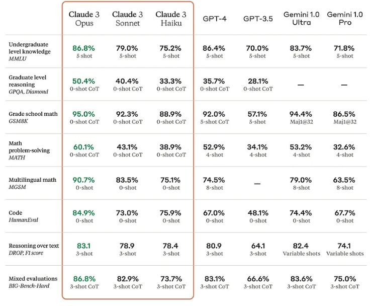

# Coding with ChatGPT Webinar

Welcome to the repository for the "CodingWithChatGPT"! This repository serves as a companion to our live webinar event, where we explore the capabilities of AI in coding with a focus on the ChatGPT model from OpenAI.

## What is ChatGPT?

ChatGPT is a state-of-the-art language processing AI developed by OpenAI. It's based on the GPT (Generative Pretrained Transformer) architecture, which allows it to generate human-like text by predicting subsequent words in a sequence. ChatGPT has been trained on a diverse dataset, enabling it to assist with a wide range of tasks, including natural language understanding, text generation, and even coding.

## The Role of AI in Coding

Artificial Intelligence is becoming more prominant the field of software development since it can be used automate repetitive tasks, suggest code improvements, identify bugs, and even write code snippets. The integration of AI into coding practices can significantly enhance developer productivity and code quality.

## Examples in this Repository

In this repository, you'll find Jupyter notebooks and code samples that demonstrate how ChatGPT can assist with different coding tasks. Here are a few highlights:

- **Example 1**: Using ChatGPT to debug, explain algorithms, optimize, document, and translate code to another language.
- **Example 2**: Using ChatGPT to scrape a webpage for information and the analysis of that data. (Web Scaping and data analysis)
- **Example 3**: Using ChatGPT to generate code based on a given specification. (A Drunken Walk and A Double Pendulum) *If extra time

Each example in the repository is documented with comments and explanations to illustrate how you can integrate ChatGPT into your coding workflow.

Feel free to explore the code, try out the examples, and see how ChatGPT can assist you in your development projects!

## Exploring Alternatives

While this webinar focuses on leveraging ChatGPT, specifically ChatGPT-4, for coding tasks, it's important to acknowledge the landscape of AI-driven development tools is vast and diverse. ChatGPT-4, a paid version developed by OpenAI, stands out for its advanced capabilities in understanding and generating human-like text, including code.

### Free and Other Paid Language Models

However, for those exploring different needs or constraints, several other Language Models offer specialized features or free access, including:

- **Gemeni**: Known for its tailored optimizations in specific coding scenarios. [Gemini](https://gemini.google.com/)
- **Claude**: Another AI model that offers a unique approach to language understanding and generation, with strengths in coding and natural language processing. [Anthropic](https://www.anthropic.com/)
- **ChatGPT-3.5**: A predecessor to ChatGPT-4, offering robust capabilities with the advantage of being freely available for certain usage limits. [OpenAI ChatGPT](https://openai.com/chatgpt)

### Recent (Last week) Claude 3 benchmarks

> Note : **Claude 3 Sonnet**, **Gemini 1.0 Pro**, and **GPT-3.5** are free.

